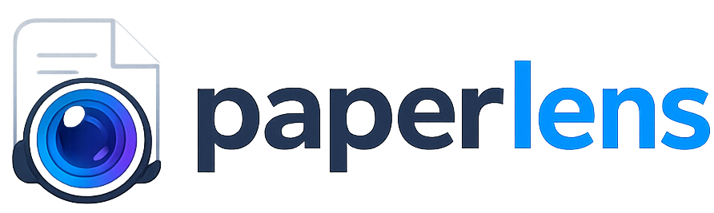

<div align="center">



### AI-Powered Academic Paper Analysis & Collaboration Platform

Upload papers, parse them with layout-aware AI, chat with your documents using RAG, and track research metrics — all in one place.

[](https://paperlens-research.vercel.app/)
[](https://paperlens-research.onrender.com)

</div>

---

## 🔗 Live Deployments

| Service | Platform | Link |
|---|---|---|
| 🖥️ Frontend Web App | Vercel | [paperlens-research.vercel.app](https://paperlens-research.vercel.app/) |
| ⚙️ Backend API | Render | [paperlens-research.onrender.com](https://paperlens-research.onrender.com) |

---

## 🛠️ Tech Stack

### Frontend

<p>


</p>

| Layer | Technology | Purpose |
|---|---|---|
| Core Framework | React 18 (Vite SPA) | Fast, modern single-page app |
| Routing | React Router v6 | Client-side navigation |
| State & Auth | Supabase Auth | Google OAuth & Email/Password |
| Styling | Vanilla CSS | Custom tokens, glassmorphism, responsive design |
| Icons | Lucide React | Lightweight icon set |

### Backend

<p>


</p>

| Layer | Technology | Purpose |
|---|---|---|
| Web Framework | FastAPI (Python 3.10+) | High-performance async API |
| RAG System | LlamaIndex | Retrieval-augmented generation pipeline |
| LLM | Gemini API (via LlamaIndex) | Answering & summarization |
| Document Parsing | LlamaParse | Layout-aware PDF ingestion |
| Database & Storage | Supabase (PostgreSQL) | Data + PDF object storage |
| Auth Verification | Supabase JWT middleware | Secure request validation |

---

## 📂 Project Structure

```text
PaperLens/
├── FrontEnd/                 # React Frontend (Vite)
│   ├── src/
│   │   ├── Components/       # Reusable UI components (Sidebar, etc.)
│   │   ├── context/          # Authentication and global contexts
│   │   ├── lib/              # Client initializations (Supabase client)
│   │   ├── pages/            # Page components (Dashboard, LoginPage, etc.)
│   │   ├── styles/           # CSS files and global variables
│   │   ├── utils/            # Utility modules (API fetch helper, services)
│   │   ├── App.css
│   │   ├── App.jsx           # Main routing & application entry
│   │   └── main.jsx
│   ├── index.html
│   ├── package.json
│   ├── vercel.json           # Vercel SPA routing configuration
│   └── vite.config.js
│
├── BackEnd/                  # FastAPI Backend
│   ├── app/
│   │   ├── api/
│   │   │   ├── routes/       # API endpoints (auth, chat, dashboard, papers)
│   │   │   └── api.py        # Centralized router definition
│   │   ├── core/             # Configuration & security settings
│   │   ├── models/           # Data schemas and Pydantic validation models
│   │   ├── services/         # Core business logic (LlamaIndex, LLM, ingestion)
│   │   ├── utils/            # Helper utilities
│   │   └── main.py           # Application entry point & CORS configuration
│   ├── Dockerfile            # Containerization configuration
│   ├── requirements.txt      # Python dependencies
│   └── .dockerignore
└── README.md                 # Project documentation
```

---

## 🚀 Key Features

- 🔐 **Secure Authentication** — User management via Supabase Auth, including email sign-in and Google OAuth.
- 📊 **Smart Dashboard** — Visualize research stats (papers uploaded, questions asked, words indexed) and recent activity.
- 📄 **Advanced Document Parsing** — LlamaParse extracts complex tables, formulas, and layouts from scientific papers.
- 💬 **Interactive RAG Chat** — Chat directly with your uploaded papers via Gemini API for context-rich Q&A and summaries.
- 🗂️ **Paper Repository** — Searchable list of uploaded papers with preview and details.

---

## ⚙️ Environment Configuration

### Frontend (`FrontEnd/.env`)
```env
VITE_SUPABASE_URL=your_supabase_url
VITE_SUPABASE_ANON_KEY=your_supabase_anon_key
VITE_API_URL=http://localhost:8000 # Set to https://paperlens-research.onrender.com for production
```

### Backend (`BackEnd/.env`)
```env
SUPABASE_URL=your_supabase_url
SUPABASE_SERVICE_KEY=your_supabase_service_role_key
SUPABASE_JWT_SECRET=your_supabase_jwt_secret
GEMINI_API_KEY=your_gemini_api_key
LLAMA_PARSE_KEY=your_llamaparse_api_key
```

---

## 💻 Local Development Setup

### Backend Setup
```bash
cd BackEnd

# Create and activate a virtual environment
python -m venv venv
# Windows:
.\venv\Scripts\activate
# macOS/Linux:
source venv/bin/activate

# Install dependencies
pip install -r requirements.txt

# Run the development server
uvicorn app.main:app --reload --port 8000
```

#### 🐳 Running Backend with Docker
```bash
docker build -t paperlens-backend .
docker run -p 8000:8000 --env-file .env paperlens-backend
```

### Frontend Setup
```bash
cd ../FrontEnd

# Install dependencies
npm install

# Run the development server
npm run dev
```
Open [http://localhost:5173](http://localhost:5173) in your browser.

---

<div align="center">

Turning papers into conversations

</div>
